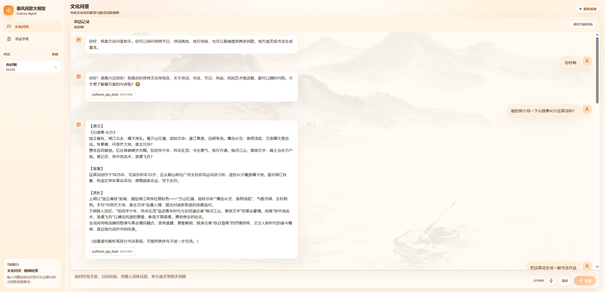
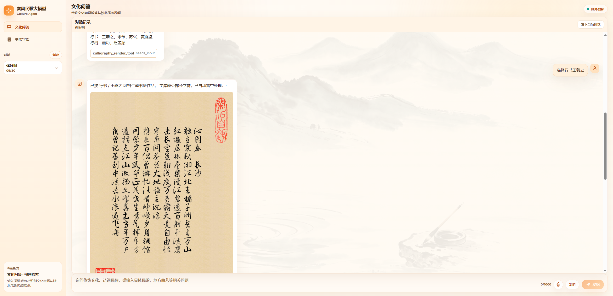
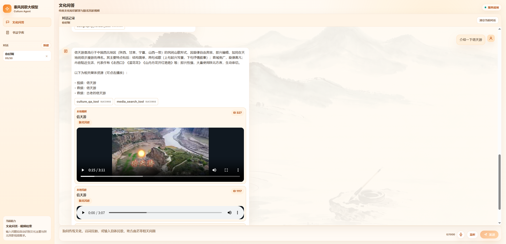

# Culture Video Agent

This project is a deployable example of a traditional-culture Agent application with:

- FastAPI backend
- Vue 3 + Vite frontend
- DeepSeek-powered cultural Q&A
- optional local media retrieval
- optional calligraphy rendering
- optional ASR/TTS integration
- optional local RAG knowledge base

## Resource Notice

本仓库不包含受版权限制的书法字库、本地音视频资源和私有知识库资料。
如需启用相关功能，请在 `.env` 中配置本地资源路径。

Typical runtime-only resources include:

- `MUSIC_ROOT`
- `VIDEO_ROOT`
- `CALLIGRAPHY_DATASET_DIR`
- `KNOWLEDGE_BASE_DOCS_DIR`
- `KNOWLEDGE_BASE_CHROMA_DIR`

Use `backend/.env.example` and `frontend/.env.example` as configuration templates.

## 项目效果

### 首页 / 对话界面

### Agent 问答效果

### 媒体检索结果

